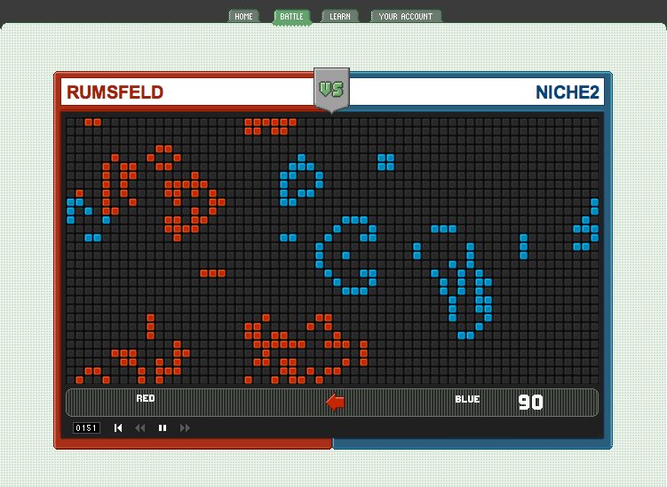

<!-- [Revealer](http://justinbakse.com/revealer/https://raw.githubusercontent.com/jbakse/psam5600_demos/master/importing_data/lecture_importing.md) -->

<!-- In the presentation, we ask that you describe how your experiences – both in your practice and your teaching – build towards a vision and philosophy for design and design education that would guide your leadership, teaching, and scholarship/creative practice at the New School.  You should plan to speak for twenty minutes only, leaving forty minutes for Q & A. Alina Gregorian, cc'ed here, will be in touch with you in the next few days to schedule your talk.
-->
<link rel="stylesheet" type="text/css" href="philosophy.css">

<h1>I am  Justin Bakse</h1>

<!-- 
Hi, I'm Justin Bakse.
That is me up there.
Well no, that _isn't_ me. That is a projection of a digital photograph of a black and white television screen. A television screen displaying a damaged video of the person I was 15 years ago. But it is me, more or less.
-
It is image documenting the performance and sculpture that was my senior thesis project at the Minneapolis College of Art and Design. For the performance I atempted to recite a poem from memory. The atempt was recorded onto vhs tape looped between two vcr's. These machines would play back and simultaniously record the performance over itself. Over the course of a few hours the recording degraded to static. The project was directly about how I had forgotten most of a silly poem that my mother said to me 100's of times when I was little. It was also about the mutability of memory and the difficulty of communication.
-
It is a little funny to me to talk about an undergradute project from so long ago, but in preparing for this talk I have been thinking of how the meaning of this project has changed for me.
-
In the years since I made that piece I have thought a lot about communication. This is a key concern both as a teacher and a practicing interaction designer.
-
It has changed because I have changed. I have been changed by time and experiences. In the years since I performed that piece I began to teach art and design, attended graduate school, started a design company, and made many more projects. In those years I also expereinced the death of my mother.
-
Those expereinces changed how I look at things, and how I interpret that piece. I beleive that, at least from my point of view, the peice itself has changed, even though the piece itself physically stopped existing shortly after the show. 
-->

# I am an Interaction Designer, Creative Coder, and Teacher

## Interaction Designer

### I studied sculpture, interactive media, and a bit of print making at the Minneapolis College of Art and Design. I studied design and installation art in the 2D Design department at the Cranbrook Academy of Art. <!-- [One A Day]((http://jbakse.netdone.com/)) -->

### After earning my MFA, I moved to NYC and started [The Studio for Interactive Media](http://tsfim.com), with my long-time friend Eric Ishii-Eckhardt. We were soon joined by Greg Schomburg. 

### Now I work at Brand New School as Director of Interactive.

## Creative Coder

### I design and build machines and games and toys and tools—all things that can be used and experienced by others. Computer programming is a primary media in much of my work. 

## And Teacher

### My teaching topics focus on the intersection of technology, art, and design, including courses on creative coding, physical computing, data visualization, and computational methods of design.

### Creative Computing (Fall 2015)
### Multiple Students - Assignment One

### Data, Design, Code (Sprint 2014)
### Laurie Waxman

### Louise Hyde

### Sarah Page

### Vanshika Swaika

### Computational Form (Spring 2016)
### Adomas Bruzga

### Brinna Thomsen

### Margaux Salgado

### Mischa Abakumova

### Peter Toh

# Teaching Philosophy

## Teaching is Important
### Only when one person is willing to share their knowledge with another, can society be advanced.

## You Can't Teach (all) the Skills Students Will Need
### Technologies change. The culture changes. The context in which artists and designers communicate changes constantly. Many skills are universal and timeless, many more are not. Perhaps the most important, long-lasting skills are those that allow a designer to recognize, understand, and adapt to these changes.

## Good Lessons Add, Better Lessons Multiply
### The value in learning a new concept or skill is magnified by drawing connections to existing concepts and skills. 

<!-- My undergraduate education started with a foundation year: drawing, sculpture, photography, digital media, an introductory graphic design course, a survey of modern art. In these classes I learned the basics of each media (good), but also developed a context for deeper understanding of my future class (better). -->

## Practice is the Most Important Thing
### It is absolutely important for a student of design to make things. You can learn a lot about design theory, art history, culture, technologies and methods by looking at other people's work, or listening to other people talk. But truly understanding how those things connect with and inform your own work absolutely requires making things.

<!--  If you want be an artist, you have to make art. The more you make, the better you will become.  -->
<!-- "Making Art is what Makes an Artist" -->

## The Best Teachers Practice and Learn Along with Their Students
### I believe that teaching is most effective when teachers focus on subjects that they have an eager interest in, and that the best teachers continue to practice and learn along with their students.

## Design Education Should Stress Higher-Order Design
### Designers need to be able to create good design. Designers must also be able to create systems that can themselves create good design. Identity designers have long needed to create systems that consider not just immediate needs, but future needs as well. As more communication design moves to digital media, and as digital media becomes more powerful and flexible, design systems thinking becomes more important.
