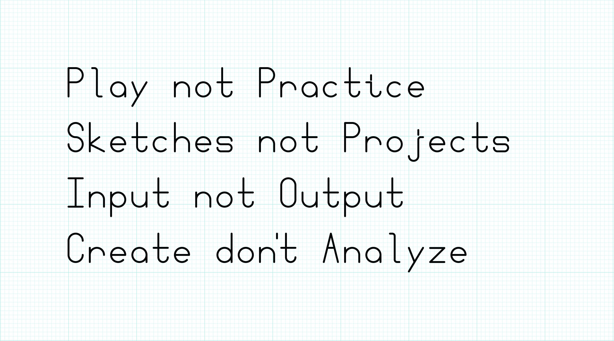

# Week 1 Class Notes

Welcome Music: [Randomly Generated by Abundant-Music](http://www.abundant-music.com/)

Intro Activity: [Sierpinski](sierpinski.html)

Today's Materials: Paper, Tiles, Various Markers

# Computational Form Course Introduction

This is a class about computational form, algorithmic image, generative art, procedural generation. In this class we will explore a creative process in which form is made by following defined processes. We will write instructions that a computer will follow to create images, animations, sounds, and sculptures. We will make things that make things.

There are many reasons designers employ algorithmic methods, some important ones include: 

- aesthetic exploration
- automation
- enhanced variety
- personalization
- dynamic content

  
> Q: Can the computer substitute for the Designer? 
> 
> A: Probably, in some special cases, but usually the computer is an aid to the Designer.
> 
— Charles Eames, Design Q&A ([Transcript](http://www.markwunsch.com/eames.html))

# What Comp Form Is

### [View Slides](what_comp_form_is.html)

# Who I am

### [View Slides](who_i_am.html)

# About this Class

## Learning Objectives
In this class we will make things that make things. We will work with a variety of programming languages, tools, and methods to create a wide variety of output: graphics, sounds, videos, animations, even 3D printed objects. The primary goals of this class are to introduce new ways of making and to encourage aesthetic exploration.

Along the way we'll use a variety of programming languages and tools:
- Javascript
- Processing
- Adobe ExtendScript Toolkit
- OpenSCAD
- Quartz Composer

We will also explore some interesting programming topics including:
- l-systems
- Markov chains
- psuedo-random numbers
- binary and hexadecimal numbers
- Voronoi diagrams
- recursion

## Class Format

The first 10 weeks will focus on exploration. In each class I will introduce a new topic or tool, usually with an in-class workshop. Throughout the week you will be expected to create daily sketches/experiments related to that topic. This emphasis on this class will be on personal exploration rather than development of specific skills.

In the last few weeks of the course you will focus on one of the concepts introduced in this class, explore the concept in greater depth, and create a larger final project.

## Prerequisites
In this class we will be exploring and creating projects in a variety of programming tools and languages, most of which will likely be new to you. To be comfortable in this class, you will need a foundation in a procedural programming language such as Javascript or Processing.

You should:

- be able to create a coded drawing project in Javascript or Processing from scratch or a template.
- understand the basics of a version control system such as git.
- be comfortable working in Adobe Illustrator and Photoshop.
- be comfortable capturing digital images with a camera and scanner.

That said, this class offers a good deal of flexibility. If you are not sure if you are ready for this class, please speak with me today to make a plan.

## Syllabus Review
Please review the [syllabus here](../syllabus.html).

## Class Introductions

### Who are _you_?

A few things I'd like to know about the class:

- Have you programmed before?
- Have you programmed in a design context before?
- How well do you know HTML/CSS?
- How well do you know Javascript?
- How well do you know Processing?
- How well do you know git/Github?

# Break

# Tile Set Workshop
## [View Slides](tile_workshop.html)

# Tile Examples
## [View Slides](tile_reference.html)

# The Class Blog 
### [http://compform.tumblr.com/](http://compform.tumblr.com/)
Our class blog will host your daily experiments and links to content of interest to the class.

# Assignments

## Assignment 1 — Tile Sketches
This is it, the first assignment and the beginning of your daily posts.

Daily exercise:
1. Create a new tile set.
2. Use the tile set to create a design.
3. Screengrab or photograph your work and post to the class blog with the hashtag `#tiles`.

Explore a different idea every day, if you need some ideas consider using one of the following as a prompt. If you use one of these prompts, include it in your blog post. `#paper`, `#pixels`, `#vectors`, `#typography`, `#self-portrait`, `#3d`, `#make-things-that-make-things`, `#hexagons`, `#triangles`, `#photocopier`, `#big`, `#huge`, `#edge`, `#corner`, `#pattern`, `#trade`, `#teamwork`, `#stamps`, `#scissors`

## Assignment 2 — Research
This week, in addition to your normal daily experiment posting, I'd like you to spend some time online looking at what others have done.

Find and explore web sites related to computational form and procedural generation. Post one link to the class blog every day this week. With each link posting include an image and a one sentence description of the site. Try to find a variety of links, and include hash tags below if applicable.

Tags: `#artist`, `#tool`, `#language`, `#article`, `#book`, `#image`, `#video`, `#sound` 

## Notes on Daily Exercises
This assignment (Assignment 1) is the first assignment based on daily creative exercise. Your goal each day should be to explore a different aspect of the weekly theme. Ideally, you will spend about an hour each day on and idea, resulting in an image or other artifact. Each day you will work on a different idea, possibly informed by something you did early in the week/class.

> What about Fridays?

Some weeks we'll have time set aside in class to make something, some weeks we won't. Don't worry about posting a project on Friday.

> So I should post something the other six days a week?

Yep.

> What if I miss a day?

Thats fine, maybe spend more time on another day and post twice.

> Can I spend, say, 6 hours all on one day? Maybe I'll pull an all-nighter.

Don't do that. This process is about exploring different ideas. Spacing out your work gives you time to think. Creativity often comes in the space between acts.

> What if I make something I like in 15 minutes?

Post it. Then keep working.

> What if I work for an hour and don't really like what I've made?

Post it. Then stop working. Try something different tomorrow.

> An hour is too short. Can I work longer? Can I post a work in progress and keep working on it tomorrow?

If after an hour, you feel excited about what you are doing then keep working or continue the next day. If you are frustrated, post and move on. If you find you often need more than an hour, you might be trying to make things that are too complex.

> I can't decide what to work on today.

If you have more than one idea, just pick one at random. Don't change your mind, just run with it. You are only investing an hour. If you have no ideas, review the class notes, do some Google image searches, be open to any ideas that pop up.

> I can't get whatever technology we are working on this week to work; my computer is broken; I missed class and I'm lost; I'm just lost this week. What should I do?

Keep posting. If you can't do exactly what you want, find something close that you can do and do that. Most weeks you could do pretty interesting projects, that relate to the weekly themes, without even using a computer.

> I'm tired of looking at the computer screen? Can I do a couple of posts with paper/paint/glue/wood/whatever?

Absolutely. The more variety between your posts the better. Do make sure that your work relates to the weekly topic.

## Additional Links

- [Maze Generation](http://www.jamisbuck.org/mazes/)
- [Wang Tiles](https://en.wikipedia.org/wiki/Wang_tile)
- [Stagecast - Wang Tile Maze Design](http://www.cr31.co.uk/stagecast/wang/intro.html)
- [Greg Schomburg - Two Minute Posters](http://designergroupies.com/twominuteposters/)
- [Immaculate Heart College Art Department Rules](https://www.brainpickings.org/2012/08/10/10-rules-for-students-and-teachers-john-cage-corita-kent/)
