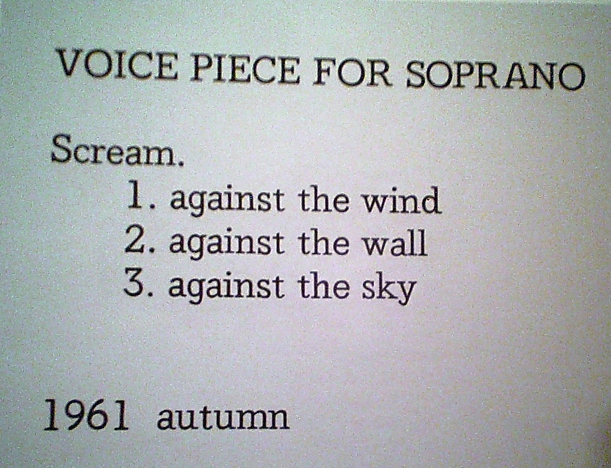

# Week 1 Class Notes

Welcome Music: [Randomly Generated by Abundant-Music](http://www.abundant-music.com/)

Today's Materials: Paper, Tiles, Various Markers

# Sierpinski
Please take out a sheet of paper and pen and follow these instructions:

1. Draw an up-pointing, equilateral triangle that fills most of the page.
2. Lightly mark the center of each line of that triangle.
3. Draw lines between each of those marks, forming four triangles: three that point up, one that points down.
4. Find an empty, up-pointing triangle.
5. Go to instruction 2.

Yes, these instructions will go on forever, I'll interrupt you in a minute.

[OftenPaper](http://www.oftenpaper.net/sierpinski.htm)
[Wikipedia](http://en.wikipedia.org/wiki/Sierpinski_triangle)

# Course Introduction

> Q: Can the computer substitute for the Designer? 
> 
> A: Probably, in some special cases, but usually the computer is an aid to the Designer.
> 
— Charles Eames, Design Q&A ([Transcript](http://www.markwunsch.com/eames.html))

This is a class about computational form, algorithmic image, generative art, procedural design. In this class we will explore a creative process in which form is made by following defined processes. We will write instructions that a computer will follow to create images, animations, sounds, and sculptures. We will make things that make things.

# What Computational Form Is

## Image

### Desmond Paul Henry - Untitled - 1962

[Artist's Site](http://www.desmondhenry.com/)

### Golan Levin - Floccular Portraits - 1999

[Floccular Portraits on Artist's Site](http://www.flong.com/projects/floccugraph/)

## Video

### Craig Reynols - Boids Simulation - 1986

[Video](https://www.youtube.com/embed/86iQiV3-3IA)

### Giuseppe Randazzo - Transmutation - 2012

[Video](https://vimeo.com/45941313), [Transmutation on Artist's Site](http://www.novastructura.net/wp/works/transmutation01/)

## Sound

### Yoko Ono - Voice Piece for Soprano - 1961

[Voice Piece for Soprano @ Moma](http://www.nytimes.com/2010/07/02/arts/design/02contemporary.html)

### John Cage - 4'33" - 1952

[4'33" on moma.org](http://www.moma.org/calendar/exhibitions/1386?locale=en), [4'33" on wikipedia](https://en.wikipedia.org/wiki/4%E2%80%B233%E2%80%B3)

## 3D

### Nervous System - Kinematics Dress 6 - 2015

[n-e-r-v-o-u-s.com/](http://n-e-r-v-o-u-s.com/)

### Micheal Hansmeyer and Benjamin Dillenburger - Digital Grotesque - 2013

[Video](https://vimeo.com/74350367), [Project Site](http://www.digital-grotesque.com/)

## Games

### Markus "Notch" Persson - Minecraft - 2009

[minecraft.net](https://minecraft.net/)

### Tarn Adams and Zach Adams - Dwarf Fortress - 2006

[Dwarf Fortress Site](http://www.bay12games.com/dwarves/)

### No Man's Sky 

[Infinite Worlds Trailer](https://www.youtube.com/watch?v=iKcumrtWzDk)

# Who I Am

I am Justin Bakse. I direct interactive projects at [Brand New School](http://www.brandnewschool.com), and teach design an programming classes here and there. [This is my site](http://justinbakse.com/).

## w/Greg Schomburg - The Raven - 2013

## Fell the Window Out - 2001

## Desk - 2015

# About this Class

## Learning Objectives
In this class we will make things that make things. We will work with a variety of programming languages, tools, and methods to create a wide variety of output: graphics, sounds, videos, animations, even 3D printed objects. The primary goals of this class are to introduce new ways of making and to encourage aesthetic exploration.

## Class Format

The first 10 weeks will focus on exploration. Each week we will introduce a new topic or tool, usually with an in-class workshop. Then, throughout the week you will be expected to post daily sketches/experiments related to that topic.

In the last few weeks of the course you will develop a final project with greater depth.

## Prerequisites
In this class we will be exploring and creating projects in a variety of programming tools and languages, most of which will likely be new to you. To be comfortable in this class, you will need a foundation in a procedural programming language such as Javascript or Processing.

You should:

- be able to create a coded drawing project in Javascript or Processing from scratch or a template.
- understand the basics of a version control system such as git.
- be comfortable working in Adobe Illustrator and Photoshop.
- be comfortable capturing digital images with a camera and scanner.

That said, this class offers a good deal of flexibility. If you are not sure if you are ready for this class, please speak with me today to make a plan.

## Syllabus Review
Please review the [syllabus here](../syllabus.html).

## Class Introductions
Who are you?

# Break

# Tile Workshop

# Assignments

### The Class Blog - [http://compform.tumblr.com/](http://compform.tumblr.com/)
Our class blog will host your daily experiments and links to content of interest to the class.

## Assignment 1 - Research

## Assignment 2 - Tile Sketches

# Tile Reference

## Anni Albers

[The Josef & Anni Albers Founation](http://www.albersfoundation.org/), [MOMA](http://www.moma.org/collection/artists/96?=undefined&page=1)

## Matthew Wahl

[Artist's Site](http://www.wahldesign.com/)

## Pauline Gorelov

[Artist's Site](http://www.paulinegorelov.com/)

## Chris Clark

[Artist's Site](http://www.chris-clarke.co.uk/)

## We Are Plural 

[Artist's Site](http://weareplural.com/work/typeforce-01/2/)

## Nintendo

## Darryl Brown

[Artist's Site](http://darryldesigns.blogspot.com/2012/01/handmade-modular-type.html)

## Unknown

## Additional Reading

- [Maze Generation](http://www.jamisbuck.org/mazes/)
- [Wang Tiles](https://en.wikipedia.org/wiki/Wang_tile)
- [Wang Tiles in Graphics](http://www.cr31.co.uk/stagecast/wang/intro.html)
