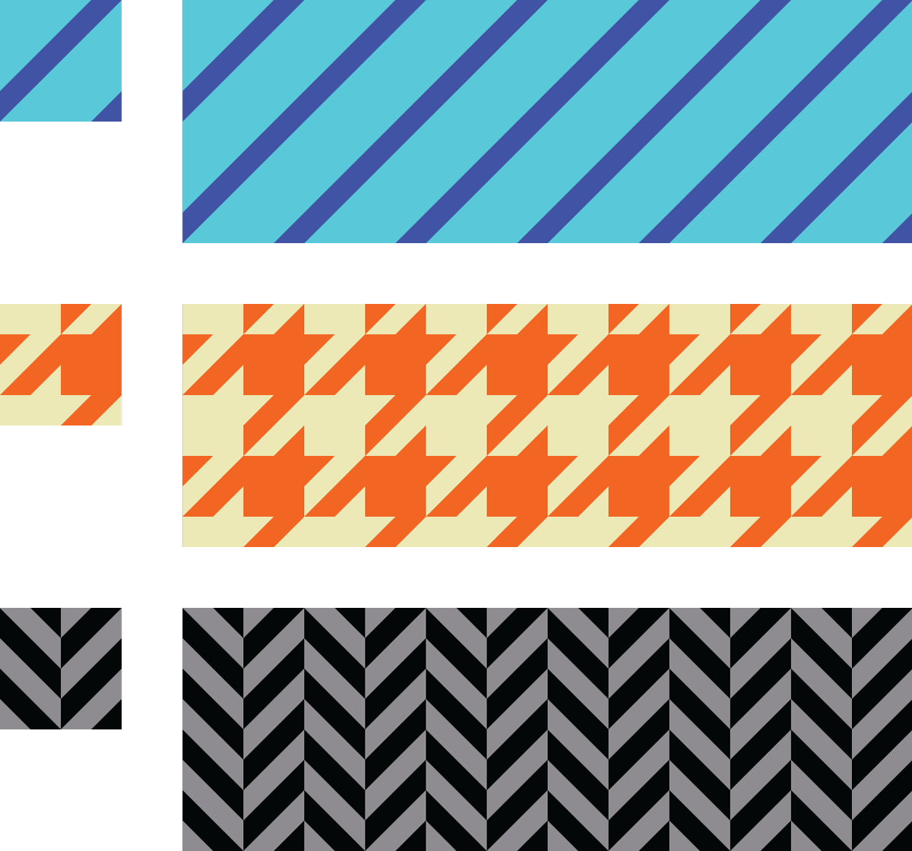
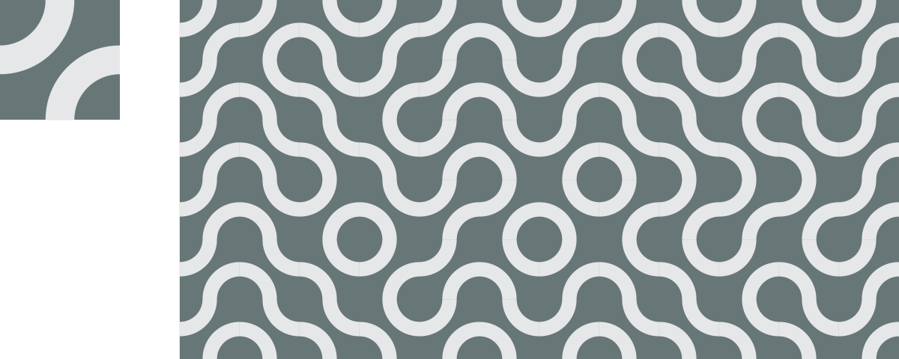
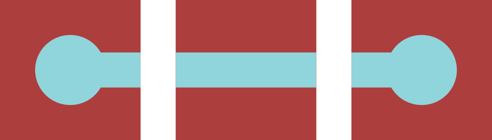
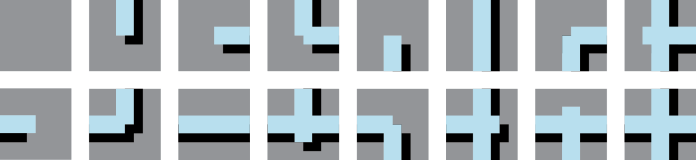
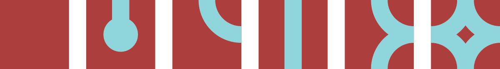
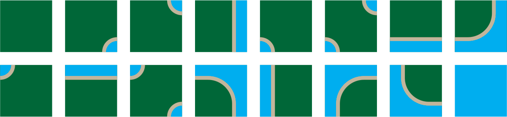

# Tile Kit Workshop

## Kits

## Repeating Tiles

### Top matches bottom, left matches right.

## Repeating Tiles with Alternates

### Top matches bottom, left matches right. Alternate tiles used to break up pattern.

## Rotatable Tiles

### Top matches bottom, left matches right. Rotated tiles still match up.

See also: [Truchet Tiles](https://en.wikipedia.org/wiki/Truchet_tiles)

## Edge-matched Tile Sets

### A set of tiles where the sides of each tile match up to the opposing side of another tile in the set. 

### One way to create a tile set is to consider each edge to be one of two states: occupied or empty. Since there are 4 sides, and each has two states, there will be 42 = 16 tiles in the set.

### Depending on the design, some of these tiles may be rotations of other tiles.

### In those cases, a smaller set will still work.

### With a set of tiles, you can start creating forms.

See also: [Wang Tiles](https://en.wikipedia.org/wiki/Wang_tile)

## Corner-matched Tile Sets

### You can also create a set by considering the corners to be empty or occupied.

# Consider
- How does this method impact design rhythm, complexity, concord, similarity, repetition?
- How are these design different from/similar to patterns?
- What kind of forms does this method lead to naturally? How can this be embraced/avoided?
- What are the essential elements of this method?
- How does working within constraints impact creativity?
- What are the advantages/disadvantaged to working by hand?
- How would variations on the tile work? Staggered? Triangles? Rectangles?
- What if each edge/corner had three states instead of two?
- How could these tiles work in 3 dimensions?
