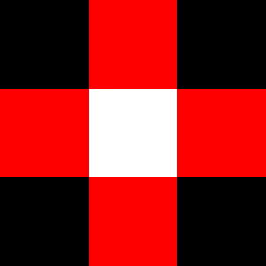

# Week 3 - Pixel Data

Time | Thing
--- | ---
3:50 | Sketch Postings Review
4:10 | Syllabus Updates
4:20 | Pixel Data 
4:30 | Study Examples
5:20 | Break
5:30 | In class work-time: Randomized Drawings


## Sketch Postings Review
[Class Sketch Blog](http://compform.tumblr.com)

## Syllabus Update
[Update Calendar](../index.html)


## Updated Grading Rubric
[See Syllabus](../syllabus.html)


# Working with Pixel Data in p5

The p5 library provides functions for loading, displaying, manipulating, and exporting images. Visit the p5 reference to see a list of these functions and example code.

[p5 Reference](http://p5js.org/reference/#group-Image)

<a href="./basic_image.js" class="p5_example show-lab show-lab-link hidden">random</a>


# Understanding the `.pixels` Data

When you call `myImage.loadPixels()`, p5 will store the image data into an array `myImage.pixels[]`. You can then read and manipulate the values in the array to modify the image data. Call `myImage.updatePixels()` when you are finished, and p5 will update the image based on the values you have set.

To use `.pixels[]` effectively, you need to know how the data is stored in the array. The [p5 reference](http://p5js.org/reference/#/p5/pixels[])  describes how the data is laid out. 

- The data is stored in an array.
- A single pixel is stored in 4 values representing the red, green, blue, and alpha components of a pixel.
- Pixels are stored starting from the upperleft corner, moving left to right and then top to bottom.


# A 3x3 Example


```
[0,   0, 0, 255,     255,   0,   0, 255,       0, 0, 0, 255, 
 255, 0, 0, 255,     255, 255, 255, 255,     255, 0, 0, 255,
 0,   0, 0, 255,     255,   0,   0, 255,       0, 0, 0, 255]

```

# Addressing a Pixel

Say we wanted to change the color of the center pixel in the image above. That pixel is in the second row and the second column. If we start counting rows and columns at 0, then the pixel is at `x = 1, y = 1`;

We can find the index in the array for that pixel by:
```
x = 1;
y = 1;
width = 3;
components_per_pixel = 4; //r, g, b, a

pixelIndex = (y * width + x) * components_per_pixel;

// 16

pixels[pixelIndex]     // 16 red
pixels[pixelIndex + 1] // 17 green
pixels[pixelIndex + 2] // 18 blue
pixels[pixelIndex + 3] // 19 alpha

```


# Image as Data
We usually interpret the data in an image as representing the intensity of gray or intesity of red, green, and blue in each pixel of the image. We can use images to store different data instead. In 3D rendering, images are often used to hold information like shininess, luminance, and bumpiness. You can use an image whenever you want to vary a parameter spacially. 

# Study Examples

### Creating an Image from Scratch

[Source](https://github.com/jbakse/p5_sketches/tree/master/sketch_createimage)

### Filtering an Image

[Source](https://github.com/jbakse/p5_sketches/tree/master/sketch_filter)


### Using an Image as Input

[Source](https://github.com/jbakse/p5_sketches/tree/master/sketch_grass)


<!-- ### Perlin Noise
look up maps/ heat maps
 -->

# Reference Images
## [View Slides](slides.html)

# Assigment

Create a daily p5.js sketch exploring the topics presented in class. Post an image of your results each day to the class sketch blog.

For those of you who prefer a little more direction, some optional prompts:

`#sampler` In cross-stiching and embroidery samplers are work pieces created to demonstrate skill. They usually feature an alphabet, and a quote, with the content be secondary to the craft. Play off of this idea by making a sketch that processes an image of the alphabet. [Sample Samplers](https://www.google.com/search?q=sampler+cross+stitch&biw=1280&bih=1297&source=lnms&tbm=isch&sa=X&ved=0ahUKEwi4zf_MmPHKAhXLWD4KHcQGAEAQ_AUIBygC)

`#ouroboros` Feed one of your screengrabs from an early sketch into a new sketch. Feed the result back into itself. Post all three images.

`#pixels_plus_tiles` Combine pixel processing with a tile set.

`#GIGO` [Garbage In Garbage Out](https://en.wikipedia.org/wiki/Garbage_in,_garbage_out). Subvert the concept of GIGO by making a program that takes an uninteresting image and makes an interesting one.


# Misc Links

- [Google Image Tron BTS](https://www.google.com/search?q=tron+without+visual+effects&safe=off&espv=2&biw=1280&bih=1297&source=lnms&tbm=isch&sa=X&ved=0ahUKEwitzuD9hefKAhWB1xQKHSdLCVUQ_AUIBigB#safe=off&tbm=isch&q=original+tron+behind+the+scenes&imgrc=3ej5bx5VYdhaCM%3A)
- [Additive Synthesis Presentation](http://jbakse.github.io/comp_demos/additive_synthesis/)
- [Perlin Noise](https://en.wikipedia.org/wiki/Perlin_noise)
- [Ken Perlin Talk on Perlin Noise](http://www.noisemachine.com/talk1/6.html)
- [How Perlin Noise is Made](http://freespace.virgin.net/hugo.elias/models/m_perlin.htm)
- [p5 Perlin Noise Function](http://p5js.org/reference/#/p5/noise)
- [Rasterbator](http://rasterbator.net/Home/Faq)
