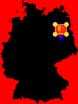

# Evil Mad Scientist Labs - Stipple Gen

- [Evil Mad Scientist - Stipple Gen](http://www.evilmadscientist.com/2012/stipplegen2/)

# Golan Levin - Floccular Portraits

- [Golan Levin - Floccular Portraits](http://www.flong.com/projects/floccugraph/)

# Sergio Albiac

- [Sergio Albiac](http://www.sergioalbiac.com/)

# Deepart.io

- [Deepart.io](https://deepart.io/)

# Greg Schomburg - Sketching 2014 Identity

- [Greg Schomburg - Sketching 2014 Site](http://sketching-in-hardware.com/2014/)

